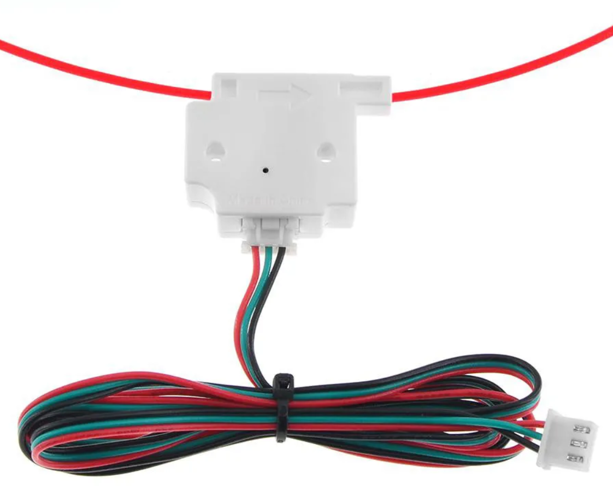
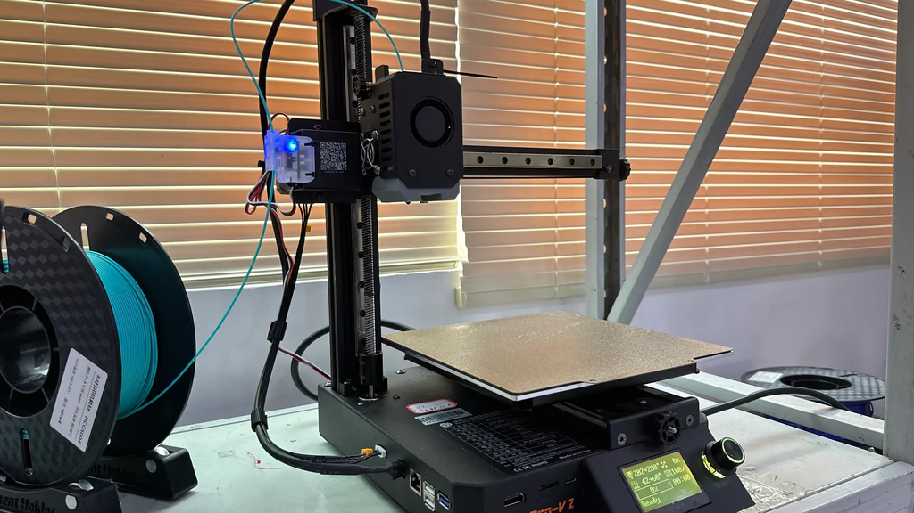

# Enable Filament Run Out Detection

> Original post [here](https://kingroon.com/blogs/3d-print-101/enable-filament-run-out-detection-on-your-kingroon-kp3s-pro-v2-in-5-minutes)

The printer does not have a filament end sensor out of box, however, it can be easily installed separately

## Step 1
First you need to purchase the Ender 3 CR10 3D Printer Filament Break Detection Module

* [Official website](https://kingroon.com/products/3d-printer-filament-detection-sensor)
* [AliExpress](https://alii.pub/6sjr66)

## Step 2
Turn off the printer, remove the bottom cover then connect the filament run out sensor to the **PA1** port.

Go to the Y-axis motor, put the cable in through the hole near it.

Then connect the it to the **PA1** port and use some zip to fix it.

After that you can put everything back and arrange the cables.

## Step 3

Arrange the cables and install the sensor. The filament sensor has a cable that is over 1 meter, you need to fix it with the current ones to make it won’t cause any troubles.

Then you can install the filament sensor with screws on the left side, like a KP3S Pro S1, or at the top of Z-axis. For the second way, you better get one print to make the filament guide smoothly. Since the KP3S Pro V2 prints in high speed, fixing it with ZIP won’t be enough.

Once you turn on the printer and insert the filament, the sensor should be on blue light. So, when the filament runs out on your KP3S Pro V2, the printing will be paused. After adding the filament, you can go the Klipper dashboard to resume it.

Since it is Klipper and our system images are updating, the resume printing might be automagical soon.